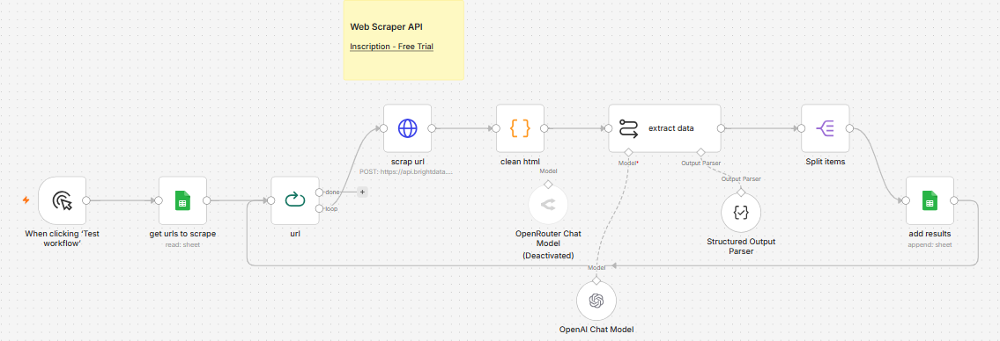

# 🛒 AI-Powered Amazon Product Search Scraper using n8n, Bright Data & OpenAI


---

# 📖 Overview

This n8n workflow automates the process of extracting structured product information from Amazon search result pages using **Bright Data's Web Scraper API** and **OpenAI GPT-4o Mini**.

Instead of manually copying product information, the workflow reads Amazon search URLs from Google Sheets, scrapes the page content through Bright Data, cleans the HTML, extracts structured product information using AI, and stores the final results back into Google Sheets.

The workflow demonstrates how AI can transform raw HTML into clean, structured business data with minimal manual effort.

-----

# 🖼️ Workflow Layout



---

# ✨ Features

* 🚀 Read Amazon search URLs from Google Sheets
* 🌐 Scrape pages using Bright Data Web Scraper API
* 🧹 Clean unnecessary HTML before AI processing
* 🤖 Extract product details using OpenAI GPT-4o Mini
* 📋 Structured JSON output with Output Parser
* 🔄 Process multiple URLs automatically
* 📊 Save extracted products into Google Sheets
* ⚡ Batch processing for scalability
* 📦 Ready for market research and price monitoring

---

# 💼 Use Cases

### 🛍️ Product Research

Collect structured product information for competitor analysis.

---

### 💰 Price Monitoring

Track product prices over time.

---

### 📈 Market Intelligence

Analyze top-selling products within different Amazon categories.

---

### 🏪 E-commerce Automation

Build product catalogs automatically.

---

### 📊 Business Analytics

Generate structured datasets for reporting dashboards.

---

### 🤖 AI Data Collection

Create clean datasets for AI or machine learning applications.

---

# 🧩 Workflow Nodes

---

# 1️⃣ Manual Trigger

📌 **Node Type**

Manual Trigger

### 🎯 Purpose

Starts the workflow manually for testing or on-demand scraping.

---

### Output

Triggers workflow execution.

---

# 2️⃣ Google Sheets (Read URLs)

📌 **Node Type**

Google Sheets

### 🎯 Purpose

Reads Amazon search URLs from a Google Sheet.

Each row contains a search URL that will be processed individually.

---

### Configuration

| Parameter   | Value              |
| ----------- | ------------------ |
| Operation   | Read               |
| Spreadsheet | Amazon Search URLs |
| Sheet       | URLs               |
| Range       | A:A                |

---

### Expected Sheet Structure

| URL                                                                            |
| ------------------------------------------------------------------------------ |
| [https://www.amazon.com/s?k=laptop](https://www.amazon.com/s?k=laptop)         |
| [https://www.amazon.com/s?k=headphones](https://www.amazon.com/s?k=headphones) |

---

### Output Example

```json
{
  "url":"https://www.amazon.com/s?k=wireless+mouse"
}
```

---

# 3️⃣ Loop Over Items

📌 **Node Type**

Loop Over Items

### 🎯 Purpose

Processes each URL one at a time.

This prevents API overload and enables sequential scraping.

---

### Benefits

* Better API management
* Lower memory usage
* Easier debugging
* Retry individual URLs

---

# 4️⃣ HTTP Request (Bright Data Web Scraper)

📌 **Node Type**

HTTP Request

### 🎯 Purpose

Sends the Amazon URL to Bright Data's Web Scraper API.

Bright Data downloads the webpage and returns the rendered HTML.

---

### Method

POST

---

### Endpoint

```text
https://api.brightdata.com/datasets/v3/trigger
```

---

### Authentication

Bearer Token

```
YOUR_BRIGHTDATA_API_KEY
```

---

### Request Body Example

```json
{
  "url":"https://www.amazon.com/s?k=wireless+mouse"
}
```

---

### Response

Large HTML page containing Amazon search results.

---

# 5️⃣ Code Node (Clean HTML)

📌 **Node Type**

Code

### 🎯 Purpose

Removes unnecessary HTML before sending content to the LLM.

Cleaning HTML significantly reduces token usage and improves extraction accuracy.

---

### Operations

* Remove `<script>` tags
* Remove CSS
* Remove comments
* Remove hidden elements
* Remove unnecessary whitespace
* Normalize HTML

---

### Output

Clean HTML document.

---

# 6️⃣ OpenAI Chat Model

📌 **Node Type**

OpenAI Chat Model

### 🎯 Purpose

Provides the Large Language Model used to understand the cleaned HTML and identify product information.

---

### Model

```
GPT-4o Mini
```

---

### Responsibilities

* Read cleaned HTML
* Understand product cards
* Ignore advertisements
* Ignore unrelated sections
* Focus only on products

---

# 7️⃣ Structured Output Parser

📌 **Node Type**

Structured Output Parser

### 🎯 Purpose

Ensures OpenAI returns predictable JSON instead of plain text.

---

### Extracted Fields

* Product Name
* Description
* Price
* Rating
* Number of Reviews

---

### Output Schema

```json
{
  "products":[
    {
      "name":"",
      "description":"",
      "price":"",
      "rating":"",
      "reviews":""
    }
  ]
}
```

---

# 8️⃣ AI Extraction Node

📌 **Node Type**

AI Chain

### 🎯 Purpose

Combines:

* Clean HTML
* GPT-4o Mini
* Structured Output Parser

to generate structured product information.

---

### Prompt Responsibilities

* Detect product listings
* Ignore sponsored content if required
* Extract only useful fields
* Return valid JSON
* Maintain consistent formatting

---

### Example Output

```json
{
  "products":[
    {
      "name":"Logitech MX Master 3S",
      "description":"Wireless productivity mouse",
      "price":"$99.99",
      "rating":"4.8",
      "reviews":"14567"
    }
  ]
}
```

---

# 9️⃣ Split Items

📌 **Node Type**

Split Items

### 🎯 Purpose

Separates the extracted product array into individual records.

Each product becomes an independent item before being written to Google Sheets.

---

### Benefits

* Easier storage
* One row per product
* Simplifies reporting
* Supports large datasets

---

# 🔟 Google Sheets (Append Results)

📌 **Node Type**

Google Sheets

### 🎯 Purpose

Stores extracted product information into a Google Sheet.

---

### Configuration

| Parameter   | Value           |
| ----------- | --------------- |
| Operation   | Append          |
| Spreadsheet | Amazon Products |
| Sheet       | Results         |

---

### Columns

| Product | Description | Price | Rating | Reviews |
| ------- | ----------- | ----- | ------ | ------- |

---

### Example Output

| Product               | Description                 | Price  | Rating | Reviews |
| --------------------- | --------------------------- | ------ | ------ | ------- |
| Logitech MX Master 3S | Wireless productivity mouse | $99.99 | 4.8    | 14567   |

---

# 🔐 Required Credentials

## 🌐 Bright Data

### Required For

* Web Scraper API
* Dynamic Amazon page extraction
* Proxy and anti-bot handling

Credential

```text
YOUR_BRIGHTDATA_API_KEY
```

---

### Bright Data Configuration

| Parameter      | Example                                                                                          |
| -------------- | ------------------------------------------------------------------------------------------------ |
| API Endpoint   | [https://api.brightdata.com/datasets/v3/trigger](https://api.brightdata.com/datasets/v3/trigger) |
| Dataset        | Amazon Product Search                                                                            |
| Authentication | Bearer Token                                                                                     |
| Method         | POST                                                                                             |

---

## 🤖 OpenAI

### Required For

* HTML Understanding
* Product Information Extraction

Credential

```text
OPENAI_API_KEY
```

Recommended Model

```text
GPT-4o Mini
```

---

## 📊 Google Sheets

### Required For

Reading URLs and storing extracted product information.

Credential

```text
Google OAuth2
```

Permissions

* Read Spreadsheet
* Append Rows

---

# ⚙️ Installation

## Step 1

Import

```text
amazon-product-search-scraper.json
```

into n8n.

---

## Step 2

Create a Bright Data credential.

---

## Step 3

Add

```text
YOUR_BRIGHTDATA_API_KEY
```

to the HTTP Request node.

---

## Step 4

Create an OpenAI credential.

---

## Step 5

Add your

```text
OPENAI_API_KEY
```

---

## Step 6

Connect Google Sheets credentials.

---

## Step 7

Create an input Google Sheet containing Amazon URLs.

---

## Step 8

Create another Google Sheet for extracted products.

---

## Step 9

Run the workflow manually.

---

## Step 10

Verify products are appended into Google Sheets.

---

# 🎨 Customization

* 🛒 Scrape different Amazon categories
* 🌎 Support multiple Amazon marketplaces (US, UK, IN, DE, etc.)
* 📦 Extract additional fields such as Brand, ASIN, Availability, Prime Badge, Seller, Delivery Date
* 📊 Export results to Airtable, Notion, SQL, or CSV
* 🔄 Schedule automatic daily or hourly scraping
* 💲 Monitor historical price changes
* 📈 Build dashboards with Power BI or Looker Studio
* 🤖 Replace GPT-4o Mini with another supported LLM
* 🧹 Enhance HTML cleaning for faster processing
* 📤 Trigger alerts when prices drop below a threshold

---

# 🛠️ Troubleshooting

| Problem                    | Cause                            | Solution                                  |
| -------------------------- | -------------------------------- | ----------------------------------------- |
| Bright Data request failed | Invalid API key                  | Verify Bright Data credentials            |
| Google Sheets not updating | OAuth expired                    | Reconnect Google Sheets                   |
| No products extracted      | Amazon page layout changed       | Update extraction prompt or parser        |
| Invalid JSON output        | Missing Structured Output Parser | Ensure parser is connected to the AI node |
| OpenAI quota exceeded      | API usage limit reached          | Check OpenAI billing and quota            |
| Empty HTML returned        | Bright Data dataset or URL issue | Verify endpoint, dataset, and search URL  |

---

# 💻 Technologies Used

* n8n
* Bright Data Web Scraper API
* Amazon Search
* OpenAI GPT-4o Mini
* Google Sheets API
* Structured Output Parser
* JavaScript
* JSON
* HTML Parsing
* AI-powered Data Extraction


---

# 🚀 Future Improvements

* 📦 Automatic pagination support
* 🔄 Continuous price monitoring
* 📉 Price history tracking
* ⭐ Sentiment analysis from customer reviews
* 🏷️ Product category classification
* 🛍️ Multi-marketplace scraping
* 📊 Interactive analytics dashboard
* ☁️ Database integration (PostgreSQL, MySQL, MongoDB)
* 🔔 Telegram/Slack notifications for price drops
* 🤖 AI-generated product summaries and comparisons

---

# 🤝 Contributing

Contributions are welcome! Feel free to fork this repository, submit pull requests, report issues, or suggest new features to improve the workflow and documentation.

---

# ⭐ Support

If you found this workflow helpful, consider giving the repository a **⭐ Star** on GitHub. It helps others discover the project and supports future development.

---

## 📌 Important Note

This workflow was originally developed and tested using the **Bright Data free trial** during development. To execute the workflow successfully after the trial period, you must have an **active Bright Data subscription** with access to the required Web Scraper API and dataset. Replace all placeholder credentials with your own API keys before running the workflow.
